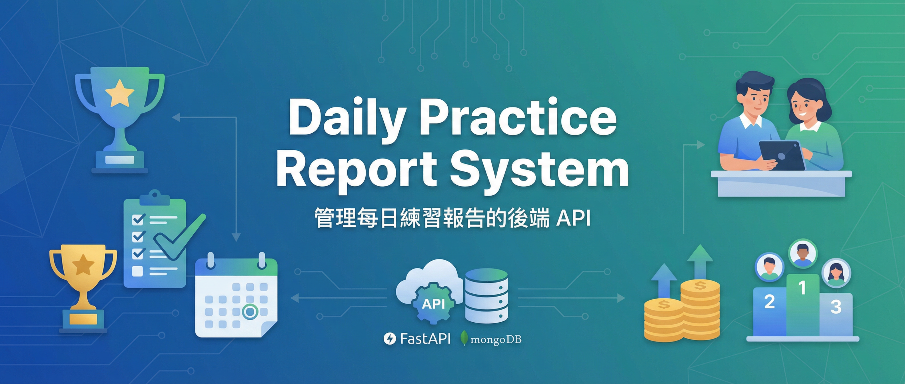

<center>



# Daily Practice Report System (DPRS)

[](https://github.com/fhcst/dprs/actions/workflows/dsl-engine.yml) | 
[](LICENSE) | 
[](CHANGELOG.md)

</center>

> [!NOTE]
> 
> 適用於教學場域的每日練習報告管理平台。教師建立班級、指派任務、審閱提交，並透過點數、徽章與排行榜提升學習動力。

---

## 功能特色

| 分類 | 功能 |
|------|------|
| **班級管理** | 建立班級、邀請碼加入（含審核機制）、公開 / 私有、班級封存 |
| **任務與提交** | 自訂欄位範本、排程指派、學生提交、教師審閱（核准 / 退回 / 補繳） |
| **每日簽到** | 可設定時間區間與有效星期，支援單日覆蓋 |
| **遊戲化** | 點數系統、自訂徽章、DSL 觸發規則、排行榜、獎品預覽 |
| **DSL 引擎** | 教師以表達式語言自訂成就觸發條件；CodeMirror 6 即時驗證、自動補全、dry-run 測試 |
| **社群** | 社群牆貼文、Emoji Reaction、Discord Webhook 通知 |
| **擴充** | Extension Registry — 支援自訂 AuthProvider、RewardProvider |

## 技術架構

| 層次 | 技術 |
|------|------|
| Runtime | Python 3.13+ |
| Framework | [FastAPI](https://fastapi.tiangolo.com/) |
| ODM | [Beanie](https://beanie-odm.dev/)（非同步 MongoDB ODM） |
| Database | MongoDB 8.0 + Redis 7 |
| 套件管理 | [uv](https://github.com/astral-sh/uv) |
| 容器化 | Docker + Docker Compose |
| **DSL 引擎** | Rust ([pest](https://pest.rs/)) → WASM (wasm-pack) + Python ([PyO3](https://pyo3.rs/) / maturin) |

---

## 快速開始

**前置需求：** [Docker](https://docs.docker.com/get-docker/) 與 Docker Compose

```bash
cp .env.example .env
# 編輯 .env，至少設定：SESSION_SECRET、MONGO_ROOT_PASSWORD、REDIS_PASSWORD

docker compose up
```

服務啟動後開啟 http://localhost:8000 — 首次啟動自動導向 **Setup Wizard**。

> 完整部署說明（含本機開發、Rust 工具鏈、多架構建置）請參閱 [docs/getting-started.md](docs/getting-started.md)
>
> 環境變數完整說明請參閱 [docs/configuration.md](docs/configuration.md)

---

## 文件索引

### 使用者文件

| 文件 | 說明 |
|------|------|
| [docs/getting-started.md](docs/getting-started.md) | 首次部署、本機開發、多架構建置 |
| [docs/configuration.md](docs/configuration.md) | 環境變數與設定完整說明 |
| [docs/user-guide/admin-setup.md](docs/user-guide/admin-setup.md) | 系統管理員設定指南 |
| [docs/user-guide/teacher-workflow.md](docs/user-guide/teacher-workflow.md) | 教師操作流程 |
| [docs/user-guide/student-workflow.md](docs/user-guide/student-workflow.md) | 學生操作流程 |

### 開發者文件

| 文件 | 說明 |
|------|------|
| [CONTRIBUTING.md](CONTRIBUTING.md) | 貢獻指南 |
| [docs/architecture.md](docs/architecture.md) | 系統架構與模組設計 |
| [docs/extensions.md](docs/extensions.md) | Extension 擴充套件開發指南 |
| [docs/migrations.md](docs/migrations.md) | 資料庫 Migration 系統 |

### 專案管理

| 文件 | 說明 |
|------|------|
| [CHANGELOG.md](CHANGELOG.md) | 版本紀錄 |
| [SECURITY.md](SECURITY.md) | 安全政策與漏洞通報 |

---

## 貢獻

歡迎提交 Pull Request！詳細流程請參閱 [CONTRIBUTING.md](CONTRIBUTING.md)。

## 安全性

發現安全漏洞請**勿**公開提交 Issue，請參閱 [SECURITY.md](SECURITY.md) 的通報流程。

## 授權

[ECL-2.0](LICENSE)
